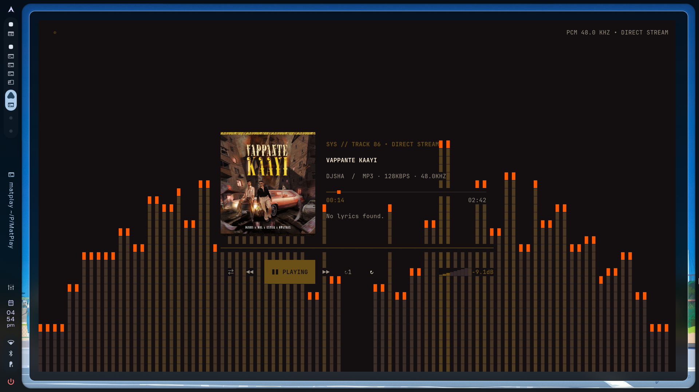
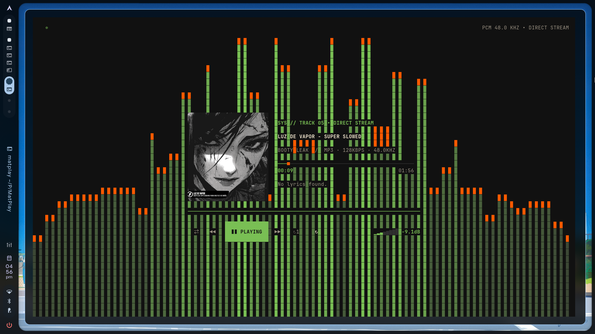
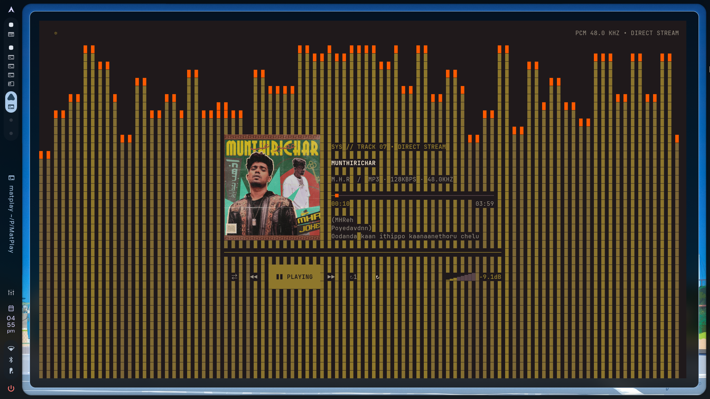

# MatPlay

> Local-first terminal music player with a cover-art-adaptive TUI. The UI
> re-skins itself from the current track's cover art (with an atomic switch),
> cover art renders as real pixels via terminal graphics protocols, and a
> CAVA-driven visualizer fills the screen behind everything.

<table style="border:none;margin:0;padding:0;">
<tr>
<td style="padding:4px 10px;border:1px solid #1e1e2e;border-radius:6px;font-family:monospace;font-size:11px;color:#8a8a9a;">v0.1.0</td>
<td style="padding:4px 10px;border:1px solid #1e1e2e;border-radius:6px;font-family:monospace;font-size:11px;color:#8a8a9a;">TypeScript</td>
<td style="padding:4px 10px;border:1px solid #1e1e2e;border-radius:6px;font-family:monospace;font-size:11px;color:#8a8a9a;">OpenTUI</td>
<td style="padding:4px 10px;border:1px solid #1e1e2e;border-radius:6px;font-family:monospace;font-size:11px;color:#8a8a9a;">React 19</td>
<td style="padding:4px 10px;border:1px solid #1e1e2e;border-radius:6px;font-family:monospace;font-size:11px;color:#8a8a9a;">Cross-Platform</td>
</tr>
</table>

---

## What MatPlay Does

MatPlay is a complete music player that runs inside your terminal. It scans
your local music library (`Playlist / Artist / Song / song.mp3`), indexes it,
and gives you a full playback experience — play, pause, seek, shuffle, queue,
loop — without ever opening a browser or external app. It renders the now
playing screen with cover art, a live CAVA spectrum visualizer, a lyrics
panel, and playback controls, all in a terminal-native interface that adapts
its colors to the current track's album art.

<b>Key features:</b>

<table style="width:100%;border-collapse:collapse;margin:12px 0;">
<tr>
<td style="padding:10px 14px;border:1px solid #1e1e2e;border-radius:8px;width:50%;"><b>🎵 Cover-art theming</b><br><font color="#8a8a9a">Palette + visualizer shift with album art</font></td>
<td style="padding:10px 14px;border:1px solid #1e1e2e;border-radius:8px;width:50%;"><b>📊 CAVA spectrum</b><br><font color="#8a8a9a">Private FIFO feed — no desktop audio captured</font></td>
</tr>
<tr>
<td style="padding:10px 14px;border:1px solid #1e1e2e;border-radius:8px;width:50%;"><b>⏩ Gapless playback</b><br><font color="#8a8a9a">mpg123 primary + ffplay fallback</font></td>
<td style="padding:10px 14px;border:1px solid #1e1e2e;border-radius:8px;width:50%;"><b>🔑 Media keys</b><br><font color="#8a8a9a">MPRIS — KDE/GNOME applet integration</font></td>
</tr>
<tr>
<td style="padding:10px 14px;border:1px solid #1e1e2e;border-radius:8px;width:50%;"><b>🔍 Search & queue</b><br><font color="#8a8a9a">Full library management in terminal</font></td>
<td style="padding:10px 14px;border:1px solid #1e1e2e;border-radius:8px;width:50%;"><b>📝 Lyrics</b><br><font color="#8a8a9a">LRC timestamps + 3-line traveling window</font></td>
</tr>
</table>

---

## Stack

- TypeScript + Node.js 26.4+ (`--experimental-ffi` required by OpenTUI)
- [OpenTUI](https://opentui.com/) + React 19 (`@opentui/react`)
- Cover art: `<image protocol="auto">` — Kitty → Sixel → Unicode blocks.
- Audio output: `mpg123` (gapless via remote protocol) behind an
  `AudioBackend`; `ffplay` (from ffmpeg) as fallback.
- Live spectrum: `cava` decoding a **private FIFO feed** — desktop audio
  (browser, notifications) never reaches the visualizer. Without cava, a
  procedural engine takes over automatically.
- No external music server (MPD/Mopidy). Everything self-contained.

## Install

**Quick start (recommended):**

```sh
git clone https://github.com/SaptodeepSarkar/MatPlay.git
cd MatPlay
./installer/install.sh        # Linux/macOS — auto-detects and installs deps
```

```powershell
git clone https://github.com/SaptodeepSarkar/MatPlay.git
cd MatPlay
powershell -ExecutionPolicy Bypass -File installer\install.ps1   # Windows
```

Both installers auto-detect what's missing, install it, build the app,
link it globally, create the config skeleton, and print config paths.

---

**Options:**

```sh
./installer/install.sh --dry-run     # show detection, install nothing
./installer/install.sh --no-system-deps  # skip system packages
./installer/install.sh --with-spotdl # add optional Spotify/YouTube downloads
./installer/detect.sh                # check deps without installing
```

---

**Manual install:** `npm install`, `npm run build`, `npm link`. Requires
Node.js ≥ 26.4, ffmpeg + ffplay; cava recommended for the live spectrum.
Install the optional downloader with `pipx install spotdl` (or
`python3 -m pip install --user spotdl`).

```sh
npm run check   # verify node/ffmpeg/ffplay/cava/fifo on any machine
npm run dev     # run from source
```

---

### Per-platform dependency notes (verified Sep 2026)

| System | ffmpeg | mpg123 | cava | Notes |
| --- | --- | --- | --- | --- |
| Arch (pacman) | extra ✓ | extra ✓ | extra ✓ | Full experience |
| Fedora (dnf) | RPM Fusion ❗ | official ✓ | official ✓ | Installer enables RPM Fusion |
| Ubuntu/Debian (apt) | main ✓ | universe ✓ | **never `apt install cava`** — that name is a Java library! Build karlstav/cava from source or use the fallback | |
| openSUSE (zypper) | Packman ❗ | OSS ✓ | OSS ✓ | Installer adds Packman |
| Alpine (apk) | main ✓ | main ✓ | edge-testing only | Falls back if missing |
| macOS (brew) | ✓ | ✓ | ✓ | Full experience |
| Windows (winget) | Gyan.FFmpeg ✓ | — | — | ffplay backend + procedural visualizer |

Node.js ≥ 26.4 never comes from distro repos — use fnm/nvm/nodejs.org
on Linux, `winget install OpenJS.NodeJS` on Windows (the script
re-verifies the version and fails loudly if winget tracks an older one).

## Screenshots

<b>MatPlay in the terminal — real screenshots, no mockups.</b>

<table style="width:100%;border:none;margin:16px 0;">
<tr>
<td style="border-radius:12px;overflow:hidden;border:1px solid #1e1e2e;">
<a href="Screenshots/index.html" target="_blank"></a>
</td>
</tr>
<tr>
<td style="border-radius:12px;overflow:hidden;border:1px solid #1e1e2e;">
<a href="Screenshots/index.html" target="_blank"></a>
</td>
</tr>
<tr>
<td style="border-radius:12px;overflow:hidden;border:1px solid #1e1e2e;">
<a href="Screenshots/index.html" target="_blank"></a>
</td>
</tr>
<tr>
<td style="border-radius:12px;overflow:hidden;border:1px solid #1e1e2e;">
<a href="Screenshots/index.html" target="_blank"></a>
</td>
</tr>
<tr>
<td style="border-radius:12px;overflow:hidden;border:1px solid #1e1e2e;">
<a href="Screenshots/index.html" target="_blank"></a>
</td>
</tr>
</table>

<a href="Screenshots/index.html" target="_blank" style="display:inline-block;padding:8px 18px;border:1px solid #2a2a3a;border-radius:8px;text-decoration:none;color:#a0a0b0;font-family:monospace;font-size:13px;">⚡ View interactive gallery →</a>

## Config

> `~/.config/matplay/config.json` (Linux/macOS) or
> `%APPDATA%\matplay\config.json` (Windows). Everything is tunable:

<details>
<summary><b>config.json</b> — click to expand</summary>

```json
{
  "musicRoot": "/home/you/Music/Spotify",
  "volume": 0.62,
  "vizGain": 1.6,
  "vizMaxHeight": 0.92,
  "lastPlaylist": "Work",
  "lastTrackId": "…"
}
```

</details>

| Key | Meaning |
| --- | ------- |
| `musicRoot` | Main folder: playlist / artist / song / song.mp3 |
| `volume` | 0..1, restored on startup |
| `vizGain` | Spectrum amplification before bar mapping |
| `vizMaxHeight` | Fraction of screen height bars may never exceed |
| `lastPlaylist` / `lastTrackId` | Resume state (no autoplay on startup) |

---

## Optional downloads and playlist sync

Install spotDL with `./installer/install.sh --with-spotdl` on Linux/macOS or
add `-WithSpotdl` to the PowerShell installer on Windows. Then open
**Settings → SPOTDL DOWNLOADS**:

- Enter a song name, Spotify track URL, playlist URL, or paste multiple song
  links separated by spaces, commas, or new lines to download them together.
- Enter the local MatPlay playlist to receive it. New names are created
  automatically, and files use `Playlist / Artist / Song / song.mp3`.
- Choose **DOWNLOAD / ADD** for a one-off import.
- Choose **SYNC SPOTIFY PLAYLIST** to create or refresh hidden sync state.
  Leave the query blank on later runs to refresh the saved playlist.
- Sync keeps removed tracks by default. Enable **DELETE LOCAL (MIRROR)** only
  when the local playlist should exactly follow Spotify; spotDL then removes
  audio and matching LRC files that disappeared from that saved playlist.

spotDL uses Spotify for metadata and YouTube for audio. Users are responsible
for complying with copyright law and the services' terms.

### spotDL credit and legal notice

A warm thank-you and full credit to the
[spotDL team and contributors](https://github.com/spotDL/spotify-downloader)
for building and maintaining the downloader that powers this optional
integration. MatPlay is not affiliated with or endorsed by spotDL, Spotify,
YouTube, or their owners.

MatPlay does **not** promote or encourage downloading copyrighted, licensed,
or otherwise protected music without permission. This integration is only a
convenience interface for content the user owns, has permission to download,
or may lawfully access, such as public-domain and appropriately licensed
material. Users are solely responsible for following copyright law, local
law, and every applicable platform's terms. MatPlay provides no media and
does not bypass DRM or access controls.

---

## Optional Alexa remote (no SmartHome skill)

MatPlay can talk to your Echo in both directions without any Alexa skill,
Lambda, or cloud service, using the same private API as the Alexa mobile
app ([alexa-remote2](https://github.com/Apollon77/alexa-remote)):

- **MatPlay → Echo (remote):** with mirroring on, `space` / `n` / `p` /
  volume keys in MatPlay also drive the Echo, so the room follows the TUI.
- **Echo → MatPlay (voice):** say *"Alexa, pause on MatPlay"*,
  *"next on MatPlay"*, *"go back on MatPlay"*, *"resume MatPlay"* — MatPlay
  polls your Alexa voice history for utterances mentioning MatPlay and
  replays them into local playback. Plain *"pause"* / *"next"* (Spotify,
  etc.) are never hijacked.

Setup (one time):

```sh
npm run alexa:login          # opens a browser login, saves the cookie to
                             # ~/.config/matplay/alexa-cookie.json
```

Then open **Settings → ALEXA** and flip it **ON**. The top bar shows
`ALEXA READY` with your speaker's name (e.g. `Kitchen · 1 speaker`).
`npm run alexa:devices` lists everything on your account — phone apps show
as `app/other`, real speakers as `SPEAKER`. Only speakers are counted or
targeted; pin one with `"device": "Kitchen"` under `alexa` in `config.json`.
Flip the toggle **OFF** and the connector is fully disposed — timers and
sockets closed, heavy dependency never loaded, zero perf cost. Cookies
refresh automatically; if Amazon changes its login, just re-run
`npm run alexa:login`.

> Unofficial API: it can break when Amazon changes things, and voice
> pickup has a few seconds of poll delay. MatPlay is not affiliated with
> or endorsed by Amazon.

### Hear MatPlay itself on the Echo (Bluetooth)

The toggle mirrors **controls**, not audio — MatPlay still decodes on your
machine. To hear it through the Echo, pair the Echo as a Bluetooth
speaker once:

1. Say *"Alexa, pair"* and pair it from your computer's Bluetooth settings.
2. Set the Echo as the default audio output (or `pactl set-default-sink`
   on Linux), then restart MatPlay so `mpg123`/`ffplay` pick up the sink.
3. Say *"Alexa, connect to my computer"* any time the link drops.

Playback, voice control (`pause on MatPlay`, …), and the visualizer keep
working — the sound just comes out of the Echo. True Wi-Fi casting
(MatPlay → Echo with no Bluetooth) needs a cloud skill serving public
stream URLs and is tracked as a later phase.

---

## Keys

<details>
<summary><b>Keyboard reference</b> — click to expand</summary>

`space` play/pause &nbsp;·&nbsp; `n`/`p` next/previous &nbsp;·&nbsp; `←/→` seek &nbsp;·&nbsp; `/` search &nbsp;·&nbsp;
`b` playlists &nbsp;·&nbsp; `Q` queue &nbsp;·&nbsp; `l` lyrics toggle &nbsp;·&nbsp; `s` settings &nbsp;·&nbsp;
`?` shortcuts &nbsp;·&nbsp; `1/2/3` shuffle/loop-list/loop-one &nbsp;·&nbsp; `+/-` volume &nbsp;·&nbsp;
`m` mute &nbsp;·&nbsp; `q` quit &nbsp;·&nbsp; `ESC` back.

</details>

---

## Layout

```txt
src/
  main.tsx            # renderer entry
  app/
    App.tsx           # now-playing screen
    config.ts         # zod config (load/save/defaults)
  ui/
    stitchTheme.ts    # StitchTheme tokens
    palette.ts        # ffmpeg sampling + theme fade
    visualizerEngine.ts
    components/       # AlbumArtwork, TrackMetadata, SeekBar,
                      # PlaybackControls, VolumeMeter, LyricsPanel,
                      # Visualizer, SettingsMenu, ShortcutsPanel,
                      # SearchOverlay, PlaylistOverlay, QueueOverlay
  library/            # scanner, search, types, diagnostics
  playback/           # AudioBackend, FfplayBackend, CavaSpectrum,
                      # SpectrumFeed (private fifo), trackMeta
  lyrics/             # lrc/txt parser
  utils/              # stable ids, path helpers
test/                 # vitest suite (30 tests)
stitch/               # Stitch design reference + sample art (mock screenshots removed — use Shots/ for real screenshots)
Shots/                # real screenshots from running the app
installer/            # install.sh (linux/macOS), install.ps1 (windows)
```

## Platform notes

- Linux/macOS: full experience (mpg123/ffplay + cava + fifo feed).
- Linux desktop applets (KDE/GNOME media controls): MatPlay registers
  `org.mpris.MediaPlayer2.matplay` with title, artist, album, duration,
  and cover art, and honors applet transport keys.
- Windows: works; no cava/fifo, so the visualizer uses the procedural
  fallback. Install ffmpeg via `winget install Gyan.FFmpeg`.
- Any terminal: Kitty graphics → Sixel → Unicode blocks, auto-negotiated.
- First run: run `./installer/install.sh` (or `.\install.ps1` on
  Windows). It detects your OS, installs missing deps, builds, links,
  and creates `~/.config/matplay/config.json` (or `%APPDATA%\matplay\`)
  with the default music root pre-filled.

---

<sub>Built with [OpenTUI](https://opentui.com/) + React 19. Screenshots
captured live in foot terminal. Mock-free — everything you see is the
real app. See <a href="Screenshots/index.html" target="_blank">Screenshots/index.html</a>
for the interactive gallery.</sub>
